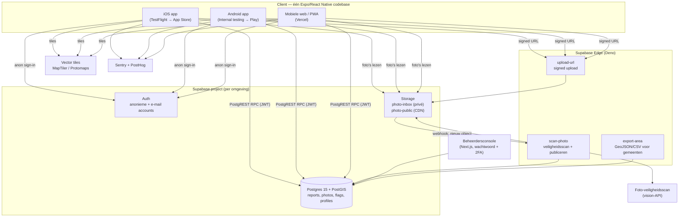
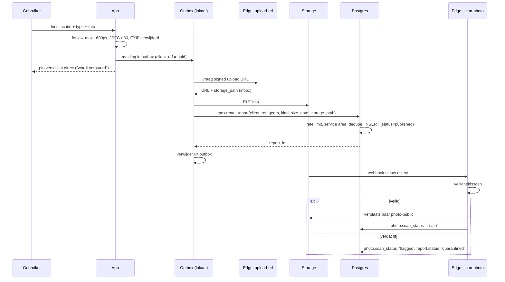
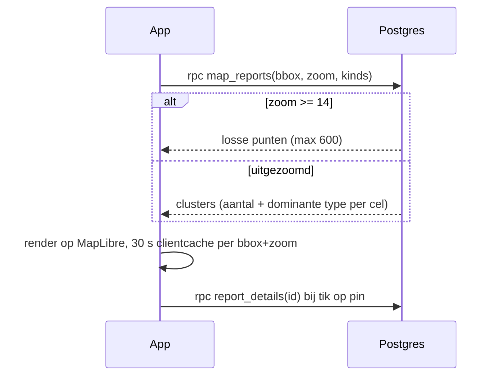

# 02 — Architectuuroverzicht

## Leidende principes

1. **Eén codebase, drie platformen.** Je wil testen op verschillende toestellen;
   drie aparte apps onderhouden is in deze fase verspilling.
2. **Managed boven zelf gehost.** Elke server die je zelf patcht, is tijd die
   niet naar het product gaat. We kiezen managed diensten met een uitstapluik
   (Postgres blijft Postgres, foto's blijven objecten in S3-compatibele storage).
3. **De database is de bron van waarheid, en bewaakt zichzelf.** Regels
   (rate limits, service area, dedupe, statusovergangen) staan in Postgres-functies
   met `security definer`, niet enkel in de client. Een aangepaste client kan de
   regels dus niet omzeilen.
4. **Anonieme gebruiker ≠ onbekende gebruiker.** Publiek is een melding anoniem;
   intern hangt ze aan een device-gebonden account, zodat we misbruik kunnen
   stoppen zonder identiteit te kennen.
5. **Offline is de normale toestand.** Wandelpaden hebben slecht bereik. Melden
   moet werken zonder netwerk.

## Componenten

## Waarom PostgREST-RPC en niet een eigen API-laag?

Supabase publiceert Postgres-functies automatisch als HTTP-endpoints
(`POST /rest/v1/rpc/<functie>`) met JWT-validatie, connection pooling en logging
inbegrepen. Onze schrijflogica is precies wat een RPC goed kan: valideren,
tellen, inserten, in één transactie. Een eigen Node-API zou hier alleen een extra
hop, extra deploy en extra faalpunt toevoegen.

We gebruiken Edge Functions **enkel** waar we buiten de database moeten:
extern netwerk (vision-API), storage-orchestratie en bestandsgeneratie.

## Dataflow 1 — melding posten (met foto)

De melding is dus **onmiddellijk zichtbaar op de kaart**; de foto pas na de scan
(seconden). Tot dan toont de pin een placeholder. Zo hoeft de gebruiker niet te
wachten en publiceren we nooit een ongescande foto.
Zie [ADR 0005](adr/0005-foto-pipeline.md).

## Dataflow 2 — kaart laden

## Omgevingen

Drie volledig gescheiden Supabase-projecten en drie app-varianten:

| Omgeving | Supabase | App | Doel |
| -------- | -------- | --- | ---- |
| `dev` | eigen project (of lokaal via `supabase start`) | Expo Go | dagelijkse ontwikkeling, seed-data |
| `staging` | eigen project, productie-achtige config | interne TestFlight/Internal testing build | device-matrix, release-kandidaat |
| `prod` | eigen project, backups + PITR | publieke store-build + PWA | echte gebruikers |

Details: [08 — Infrastructuur](08-infra-omgevingen-cicd.md).

## Wat er bewust simpel blijft (en wanneer dat verandert)

| Vereenvoudiging in v1 | Opschaaltrigger | Volgende stap |
| --------------------- | --------------- | ------------- |
| Kaartdata via bbox-RPC, clustering in SQL | >50k actieve meldingen of p95 > 400 ms | `ST_AsMVT`-tile-endpoint achter CDN ([06](06-kaart-en-performance.md)) |
| Geen eigen API-laag | Zodra we logica nodig hebben die niet in SQL/Deno past | Aparte service, zelfde Postgres |
| Foto's op Supabase Storage-CDN | >100 GB of hoge egress-kost | Cloudflare R2 + Images |
| Moderatie door één persoon | >20 quarantaines/dag | Vertrouwde-melder-status + community-verificatie ([ADR 0008](adr/0008-moderatie-model.md)) |
| Eén regio (België) | Vraag uit ander land | Rij toevoegen in `service_areas`, tiles zijn al wereldwijd |
