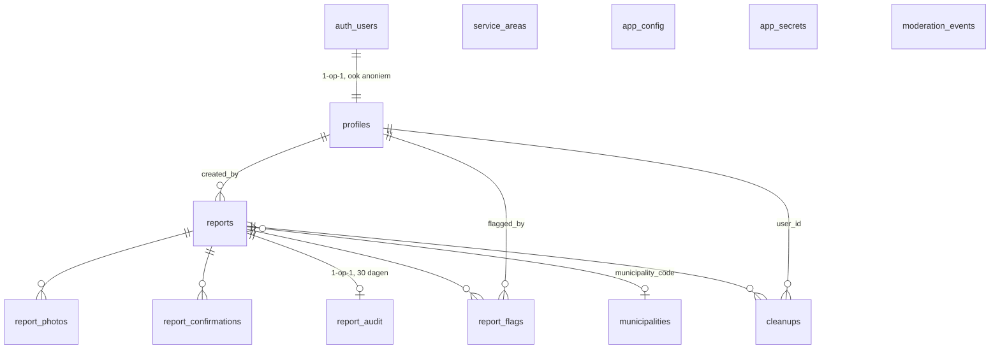

# 03 — Datamodel

Uitvoerbare versie: `db/migrations/`. Dit document legt de *waarom* uit.

## Overzicht

## Ontwerpkeuzes die later pijn zouden geven

| Keuze | Waarom nu al | Wat het later voorkomt |
| ----- | ------------ | ---------------------- |
| `report_kind` bevat **alle** types (hazard, dead_animal, fallen_tree, …), UI toont enkel `litter` | Een enum uitbreiden op een grote tabel is een lock; nu is de tabel leeg | Fase-3-migratie op productie |
| `report_photos` is een aparte 1-op-n tabel, geen kolom | Kost nu niets | "Meerdere foto's" wordt een UI-wijziging, geen migratie |
| `cleanups` + `points` + `trust_level` staan er al | Kost nu niets | Fase 2 raakt het schema niet |
| `client_ref` met unieke index per gebruiker | Nodig voor de offline outbox | Dubbele meldingen bij netwerkretries |
| `geography` i.p.v. `geometry` | `ST_DWithin` en `ST_Distance` geven meteen meters | Overal handmatig projecteren |
| `app_config`-tabel voor limieten en feature flags | Kost nu niets | Een deploy nodig om een rate limit bij te stellen tijdens een incident |
| `status` als enum met `quarantined` | Moderatie moet er van dag 1 zijn | Verwijderen als enige optie, dus onomkeerbaar |

## De kerntabel: `reports`

| Kolom | Type | Rol |
| ----- | ---- | --- |
| `id` | uuid | publieke identificatie |
| `client_ref` | uuid | door de client bepaald; maakt posten idempotent |
| `kind` | enum | soort melding; v1 enkel `litter` |
| `size` | enum | `piece` / `bag` / `heap` — de drie symbolen uit de UI |
| `geom` | geography(Point) | locatie, WGS84 |
| `accuracy_m` | numeric | GPS-nauwkeurigheid; nodig om "onbetrouwbare pin" te tonen |
| `note` | text ≤280 | vrije tekst, optioneel |
| `status` | enum | `published` / `quarantined` / `cleaned` / `removed` |
| `photo_count`, `flag_count`, `confirm_count` | smallint | gedenormaliseerd, zodat de kaartquery geen joins nodig heeft |
| `municipality_code` | text | automatisch bepaald, voor export naar gemeenten |
| `created_by` | uuid | intern; **nooit** in een publiek antwoord |
| `created_client` | enum | ios/android/web — onmisbaar bij het debuggen van device-specifieke bugs |
| `cleaned_at/by`, `moderated_at/by` | | fase 2 en moderatie |

### Afgedwongen invarianten

Deze staan als `CHECK` in de database, niet enkel in de client:

- `litter_requires_size` — een afvalmelding zonder grootte kan niet bestaan.
- `size_only_for_litter` — een omgevallen boom heeft geen "papiertje"-grootte.
- `cleaned_has_timestamp` — status `cleaned` en `cleaned_at` gaan altijd samen.
- `client_ref_unique_per_user` — dezelfde melding twee keer posten is onmogelijk.
- `note` max 280 tekens; `photo_count` max 3.

## Indexen en waarom ze er zijn

| Index | Query die hem gebruikt |
| ----- | ---------------------- |
| `reports_geom_gix` (GiST, **partieel** op zichtbare statussen) | de kaartquery — dit is dé hot path |
| `reports_status_created_idx` | retentiejob, moderatiewachtrij, lijsten (filteren altijd op status) |
| `reports_created_by_idx` | rate limit (telt eigen meldingen in het laatste uur) |
| `reports_municipality_idx` (partieel) | export per gemeente |
| `report_photos_pending_idx` (partieel) | vastgelopen scans opsporen |

De partiële geo-index is de belangrijkste optimalisatie: verwijderde en
gequarantineerde meldingen staan er niet in, dus de kaartquery leest ze nooit.

## Beveiliging: RLS + security definer

Twee lagen, en ze doen bewust iets anders:

1. **RLS op de tabellen** bepaalt wat een client mag *lezen*: gepubliceerde
   meldingen, zijn eigen meldingen, en gescande foto's. `report_audit` en
   `moderation_events` en `app_secrets` hebben géén enkele policy — dus geen
   enkele rij, zelfs
   niet als iemand met een geldig token rechtstreeks de tabel aanspreekt.
2. **Security-definer-functies** zijn de enige manier om te *schrijven*.
   `INSERT`, `UPDATE` en `DELETE` zijn ingetrokken voor `anon` en
   `authenticated`. Een aangepaste client kan dus geen melding met 10 000 punten
   maken, geen andermans melding wijzigen, en de rate limit niet overslaan.

`db/test/10_tests.sql` test dat allebei expliciet (een directe `INSERT` als
rol `authenticated` moet falen; `anon` moet nul rijen zien in `report_audit`).

## Retentie

`purge_old_data()` draait dagelijks (pg_cron, 03:17):

| Data | Bewaartermijn | Reden |
| ---- | ------------- | ----- |
| Opgeruimde/verwijderde meldingen | 365 dagen (`app_config.retention_days`) | historische waarde vervalt; GDPR-minimalisatie |
| Open meldingen | onbeperkt | een melding die er nog ligt, blijft relevant |
| `report_audit` (IP-**hash**, user agent) | 30 dagen | genoeg voor misbruikonderzoek, niet meer |
| Salt van de IP-hash | roteert maandelijks | na rotatie is oudere data niet meer te correleren |
| Foto's met `scan_status = 'pending'` na 24 u | → `failed` | een vastgelopen scan mag nooit stil publiceren |

Foto's van een verwijderde melding verdwijnen mee via `on delete cascade` op
`report_photos`; het storage-object zelf wordt opgeruimd door de
`cleanup-orphan-photos`-taak (zie [08](08-infra-omgevingen-cicd.md)).

## Migratiediscipline

- Migraties zijn **voorwaarts en additief**: nieuwe kolom = nullable of met
  default. Een kolom verwijderen gebeurt in twee releases (eerst niet meer
  gebruiken, daarna droppen), zodat een oude app-versie in de stores blijft
  werken.
- Elke migratie moet op een lege én op een gevulde databank kunnen lopen; CI
  test beide (`.github/workflows/ci.yml`).
- `db/scale/` bevat migraties die je pas toepast als een opschaaltrigger afgaat.
  Ze staan bewust buiten de normale reeks zodat `supabase db push` ze niet
  automatisch meeneemt.
