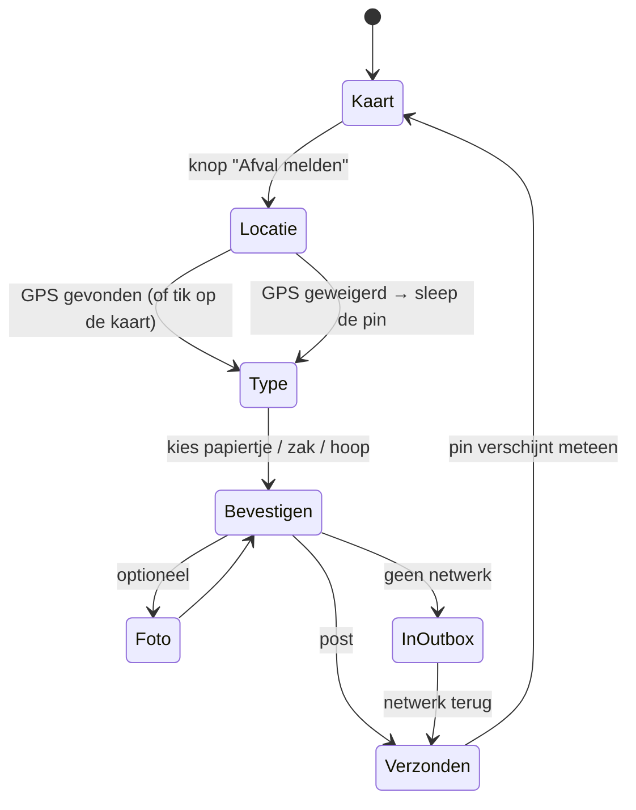

# 05 — Mobiele client

Eén Expo/React Native-codebase → iOS, Android en mobiel web.
Zie [ADR 0001](adr/0001-client-platform-expo.md) voor de afweging.

## Repostructuur

Wat er nu staat (sprint 1 + 2), met een ✅ voor wat gebouwd is:

```
apps/mobile/            Expo app (iOS, Android, web)          ✅
  app/                  expo-router: bestandsgebaseerde routes
    (tabs)/
      index.tsx           kaart (startscherm)                 ✅
      mine.tsx            mijn meldingen                      ✅
      settings.tsx        instellingen + diagnose             ✅
    report/
      [id].tsx            detail van een melding              ✅
      nieuw.tsx           meldflow: locatie → type → posten   ✅
  src/
    api/                supabase-client, RPC's, query-hooks   ✅
    auth/               anonieme sessie                       ✅
    map/                MapLibre-wrapper, markers, fallback   ✅
    report/             meldflow-logica, GPS, optimistische pin ✅
    config/             omgevingsvariabelen                   ✅
    ui/                 thema (kleuren, maten, raakvlakken)   ✅
    outbox/             offline wachtrij                      (sprint 3)
    i18n/               nl.json, en.json                      (sprint 5)
    telemetry/          Sentry + PostHog                       (sprint 4)
  e2e/                  browsertest tegen een nagemaakt backend ✅
  test/                 unittests op pure logica              ✅
apps/admin/             Next.js beheerdersconsole             (sprint 4)
packages/shared/        types, foutcodes, bbox, punten        ✅
```

Monorepo met pnpm workspaces — zie [ADR 0007](adr/0007-repo-structuur.md).

## De meldflow in detail

Doel: **p95 onder 15 seconden**, van app openen tot melding gepost.



Ontwerpregels die de 15 seconden halen:

1. **Geen inlogscherm.** Bij de eerste start doet de app stil een anonieme
   `signInAnonymously()`. Lukt dat niet, dan kan de gebruiker de kaart nog
   bekijken en offline melden; de sessie wordt later aangevraagd.
2. **Type kiezen is één tik.** Drie grote iconen, geen dropdown, geen
   verplichte tekst. De grootte-keuze is meteen de bevestiging.
3. **Locatie is al bezig.** GPS wordt aangevraagd op het moment dat de
   meldknop verschijnt, niet als de gebruiker erop tikt.
4. **De foto blokkeert niets.** Verkleinen en uploaden gebeurt op de
   achtergrond; de melding wordt gepost zodra het `storage_path` bekend is, en
   bij een mislukte upload gaat de melding alsnog door zonder foto.
5. **Optimistisch renderen.** De pin staat direct op de kaart met een
   "wordt verstuurd"-status.

### Wanneer we níet meteen posten

Als `nearby_reports` binnen 20 m al een melding van hetzelfde type vindt, toont
de app "Hier is al iets gemeld" met twee keuzes: *bevestigen* (`confirm_report`)
of *toch apart melden*. Dat houdt de kaart schoon zonder de gebruiker te blokkeren.

## Offline outbox

Zie [ADR 0006](adr/0006-offline-outbox.md). Kern:

- Lokale SQLite-tabel `outbox(client_ref, payload, photo_uri, attempts,
  next_attempt_at, last_error)`.
- `client_ref` wordt aangemaakt bij het tikken op "posten" en is de identiteit
  van de melding. Daardoor is elke retry veilig.
- Sync-trigger: app naar voorgrond, netwerk terug (`expo-network`), en een
  timer op `next_attempt_at`.
- Backoff: 2 s, 4 s, 8 s, 30 s, 5 min, daarna elk kwartier.
- Definitieve fouten (zie [foutcodetabel](04-api-contract.md#foutcodes))
  halen het item uit de outbox met een zichtbare melding; alle andere fouten
  laten het item staan.
- De outbox is zichtbaar in de UI ("1 melding wacht op verbinding") — een
  onzichtbare wachtrij voelt als dataverlies.

## Foto's op het toestel

```
camera → expo-image-manipulator
       → schaal naar max 1600 px langste zijde
       → JPEG kwaliteit 0,8
       → re-encoderen verwijdert alle EXIF (dus ook GPS)
       → typisch 150–400 kB
```

Het re-encoderen is niet alleen compressie: het is de **privacymaatregel** die
GPS-, toestel- en tijdstempelmetadata uit de foto haalt vóór ze het toestel
verlaat. De locatie die we bewaren is enkel die van de melding zelf.
Zie [07](07-privacy-security-moderatie.md).

## Permissies

| Permissie | Wanneer gevraagd | Als geweigerd |
| --------- | ---------------- | ------------- |
| Locatie (bij gebruik) | pas bij de eerste melding, met uitleg | pin handmatig plaatsen; alles blijft werken |
| Camera | pas bij het tikken op "foto" | melden zonder foto |
| Fotobibliotheek | idem | idem |
| Notificaties | **niet in v1** | — |

We vragen nooit "altijd toestaan"-locatie, en er is geen achtergrondtracking.
Dat is zowel een privacykeuze als een reviewkeuze: het maakt de App
Store-privacylabels eenvoudig verdedigbaar.

## State en caching

| Wat | Waar | Waarom |
| --- | ---- | ------ |
| Kaartmarkers | TanStack Query, key `[bbox-raster, zoom, filters]`, 30 s stale | pannen mag niet elke keer opnieuw laden |
| Meldingdetail | TanStack Query, 5 min | detailvenster opent instant na het tikken |
| Outbox | SQLite (expo-sqlite) | moet een herstart overleven |
| Sessie | expo-secure-store | anonieme identiteit moet blijven, anders verlies je je meldingen |
| Instellingen | AsyncStorage | onbelangrijk bij verlies |

Bbox-keys worden op een raster afgerond (op ~1/8 van de vensterbreedte) zodat
kleine pans dezelfde cache-entry raken in plaats van elke pixel een nieuwe query.

## Toegankelijkheid

Niet optioneel: de doelgroep is breed en het scherm wordt buiten in de zon
gebruikt.

- Contrast ≥ 4,5:1; markers onderscheiden zich door **vorm én kleur**, niet
  door kleur alleen.
- Alle raakvlakken ≥ 44×44 pt.
- Labels voor screenreaders op de drie typekeuzes en op elke marker
  ("afvalzak, 120 meter, gemeld 2 dagen geleden").
- Werkt met systeemlettergrootte tot 200 %; het meldformulier scrollt.
- Volledig bedienbaar met één hand: de meldknop staat rechtsonder.

## Web-variant

Dezelfde codebase via Expo Web, met `maplibre-gl` in plaats van de native
kaartmodule. De splitsing loopt via Metro's platform-extensies:
`src/map/MapCanvas.tsx` op native, `src/map/MapCanvas.web.tsx` op web, met
identieke props uit `src/map/types.ts`. Bedoeld voor:

- testen zonder installatie (jij deelt één URL en iedereen kan mee),
- gebruikers die geen app willen installeren,
- de gemeente die even op een laptop wil kijken.

Beperkingen die we accepteren: geen achtergrondsync van de outbox (enkel zolang
het tabblad open is), en GPS-nauwkeurigheid is op desktop slechter. De web-app
toont daarom een expliciete hint om de pin te controleren.

**De maplibre-worker moet meegeleverd worden.** maplibre-gl parseert GeoJSON in
een web worker en verwijst daarnaar met `new Worker(new URL(...,
import.meta.url))`. Metro begrijpt die vorm niet en bundelt het bestand niet
mee: de browser vraagt het op, krijgt `index.html` terug, en de kaartbron raakt
nooit "geladen". Het gevolg is een **lege kaart zonder enige foutmelding** — de
markers zitten wel in de state, maar worden nooit getekend.

`scripts/prepare-web-assets.mjs` kopieert de worker naar `public/maplibre/`, en
`MapCanvas.web.tsx` wijst er met `setWorkerUrl` naartoe. Elk script dat een
web-build maakt (`pnpm web`, `pnpm web:build`, `pnpm e2e:build`) draait die
voorbereiding. Bouw je met een eigen `expo export`-commando, doe dan eerst
`pnpm prepare:web`.

De end-to-end test controleert dit expliciet: hij vraagt de kaart hoeveel
markers ze getekend heeft en of de worker als javascript geserveerd wordt.
Alleen kijken of er een canvas bestaat, was niet genoeg — die test stond groen
terwijl de kaart leeg was.

**Labels vragen een echte kaartstijl.** Een symbol-laag heeft glyphs (fonts)
nodig, en die komen uit de stijl. Zonder MapTiler-key laten we de tekstlaag weg:
een stijl zónder glyphs bereikt nooit de toestand "geladen" zodra er toch tekst
in staat, en dan verdwijnt álles. Je ziet dan clusterbollen op grootte, met het
totaal in de balk bovenaan.

**Hosting:** de web-build is een SPA (`web.output: 'single'`). Elke host moet
onbekende paden naar `index.html` laten wijzen, anders werkt een directe link
naar `/report/<id>` niet. Op Vercel en Netlify is dat de standaard-SPA-rewrite;
zie ook de toelichting in [ADR 0001](adr/0001-client-platform-expo.md).

**Kaart zonder MapTiler-key:** dan valt de app terug op een effen ondergrond met
de markers erop, in plaats van te falen. Handig om het backend te testen zonder
kaartaccount.
