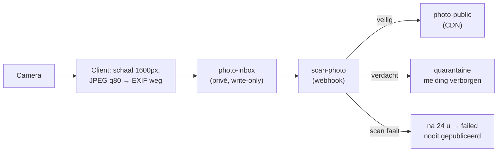

# 07 — Privacy, security & moderatie

Dit document is geen bijlage: het bepaalt of je publiek kán gaan. Een app die
foto's van de publieke ruimte verzamelt en op een open kaart zet, verwerkt
persoonsgegevens — ook als er geen account aan te pas komt.

## Wat we verwerken, en waarom

| Gegeven | Grondslag | Bewaartermijn | Publiek zichtbaar |
| ------- | --------- | ------------- | ----------------- |
| Locatie van de melding | gerechtvaardigd belang (openbare netheid) | tot opgeruimd + 365 d | **ja** — dat is het product |
| Foto van de melding | idem, na veiligheidsscan | idem | ja, na scan |
| Type/grootte/notitie | idem | idem | ja |
| Anonieme gebruikers-id (uuid) | noodzakelijk voor misbruikbestrijding | zolang het account bestaat | **nee, nooit** |
| GPS-nauwkeurigheid, platform, app-versie | technisch nodig voor debuggen | idem als de melding | nee |
| IP-**hash** + user agent | gerechtvaardigd belang (misbruik) | **30 dagen** | nee |
| E-mail (enkel wie in fase 2 een account maakt) | uitvoering overeenkomst | tot verwijdering | nee |

Wat we bewust **niet** verzamelen: geen achtergrondlocatie, geen advertentie-id,
geen contactenlijst, geen locatiegeschiedenis van de gebruiker (enkel de punten
die hij zelf meldt), geen ruwe IP-adressen in de databank.

### Hoe de IP-hash werkt

Er komt nooit een ruw IP-adres in de databank. `create_report` leest het
`x-forwarded-for`-veld dat PostgREST doorgeeft, neemt daar alleen het **eerste**
adres uit (de rest is proxyketen), en slaat er een SHA-256 van op met een salt
die in `app_config` zit — niet in de code, dus niet in git.

Die salt **roteert maandelijks** (in `purge_old_data`, zodra hij ouder is dan de
auditbewaartermijn). Na een rotatie is correlatie over de grens heen onmogelijk,
en dat is precies de bedoeling: de rijen van vóór de rotatie zijn dan toch al
gewist. Wat overblijft is genoeg om binnen één maand te zien dat honderd
meldingen van dezelfde bron komen, en te weinig om iemand te identificeren.

Ontbreken de headers (een cronjob, een directe SQL-aanroep, een test), dan
blijft `ip_hash` leeg en gaat de melding gewoon door. Misbruikdetectie mag nooit
een reden zijn waarom een melding faalt.

`db/test/10_tests.sql` test dit expliciet: de hash is 64 tekens, bevat het
adres niet, is stabiel per adres, verschilt per adres, negeert de proxyketen, en
verandert na een salt-rotatie.

## Anonimiteit: wat het wel en niet betekent

De kaart is **publiek anoniem**: geen enkel antwoord van de API bevat de melder.
`report_details` geeft alleen `is_mine`, en dat wordt server-side uit het token
bepaald — de identiteit gaat nooit over de lijn.

De kaart is **niet volledig identiteitsloos**: elke melding hangt intern aan een
anonieme account-uuid. Zonder dat is misbruikbestrijding onmogelijk (je kan geen
rate limit afdwingen op "niemand"). Zie [ADR 0003](adr/0003-anonieme-identiteit.md).

Dat zeggen we ook zo in de privacyverklaring, want het is een eerlijk verschil.

### Twee restrisico's die we expliciet aanvaarden

1. **Meldingen bij een woning.** Wie consequent afval meldt aan het einde van
   zijn eigen oprit, maakt daarmee een aanwijzing over zijn woonplaats. We
   verkleinen dat niet met fuzzing (dat maakt de kaart onbruikbaar voor
   opruimers), maar we tonen bij de eerste melding één keer de tekst
   *"Je melding is publiek zichtbaar op de exacte locatie."*
2. **Herkenbare personen op foto's.** De scan vangt het grootste deel af, maar
   niet alles. Daarom is `private_person` een aparte rapportreden die de melding
   **onmiddellijk** in quarantaine zet — één klacht is genoeg, geen drempel van
   drie.

## Fotopijplijn

Zie [ADR 0005](adr/0005-foto-pipeline.md).

Drie maatregelen die op elkaar ingrijpen:

1. **EXIF verdwijnt op het toestel.** Het re-encoderen naar JPEG haalt GPS,
   toestel-id en tijdstempel uit het bestand vóór het uploadt. De enige locatie
   die we hebben, is die van de melding zelf.
2. **Niets wordt gepubliceerd vóór de scan.** `photo-inbox` heeft geen
   leespolicy — zelfs met een geldig token krijg je er niets uit. Een foto komt
   pas in `photo-public` (en dus op de CDN) nadat de scanner hem heeft
   goedgekeurd.
3. **Falen is stil, niet permissief.** Een scan die vastloopt zet de foto na
   24 uur op `failed`. Er is geen pad waarlangs een ongescande foto publiek wordt.

De classifier (een vision-API met labels voor expliciete inhoud, geweld en
duidelijk zichtbare gezichten) is een externe dienst. Dat is een
subverwerker; die moet in het verwerkingsregister en in de privacyverklaring.
Kies bij voorkeur een EU-regio.

## Misbruikbestrijding

| Vector | Maatregel | Waar afgedwongen |
| ------ | --------- | ---------------- |
| Spamvloed | 15 meldingen/uur, 40/dag per account | `create_report`, database |
| Dubbele meldingen | eigen melding binnen 15 m + 24 u wordt teruggegeven i.p.v. gedupliceerd | database |
| Verzonnen locaties | melding moet in een actief servicegebied liggen | database |
| Wegwerpaccounts | account is nodig om te posten; IP-hash correleert 30 dagen | `report_audit` |
| Geautomatiseerd posten | Cloudflare Turnstile op de web-app; App Attest / Play Integrity op native (fase 1.5) | Edge Function |
| Ongepaste foto's | scan vóór publicatie + `private_person`-fastpath | pijplijn |
| Kaart leegtrekken | `bbox_too_large`, cap van 600/800 rijen | database |
| Manipuleren van punten | punten worden server-side berekend, GPS-nabijheid vereist | `mark_cleaned` |

Alle limieten staan in `app_config` en zijn **tijdens een incident aanpasbaar
zonder deploy**. Dat is bewust: bij een spamgolf wil je de limiet in dertig
seconden kunnen halveren.

### Waarom de client niets mag beslissen

`INSERT`, `UPDATE` en `DELETE` zijn ingetrokken voor `anon` en `authenticated`.
Iemand met de (publieke) anon key en een gedecompileerde app kan dus geen rij
schrijven, geen andermans melding wijzigen en geen punten toekennen. De tests in
`db/test/10_tests.sql` controleren dat expliciet.

## Moderatie

Model: **publiceren-dan-modereren, met automatische quarantaine**.
Zie [ADR 0008](adr/0008-moderatie-model.md).

| Trigger | Gevolg |
| ------- | ------ |
| 3 flags | automatisch in quarantaine |
| 1 flag `private_person` | onmiddellijk in quarantaine |
| Foto afgekeurd door de scan | onmiddellijk in quarantaine |
| Moderator: `restore` / `remove` | definitief, gelogd in `moderation_events` |
| Herhaald misbruik | `block_user` (standaard 30 dagen) |

De beheerdersconsole (`apps/admin`, Next.js) toont de quarantainewachtrij met
foto, locatie, reden en de andere meldingen van dezelfde gebruiker. Elke
handeling landt in `moderation_events` — inclusief wie ze deed.

**Wat je vóór de publieke roll-out moet hebben ingericht:**

- Een bereikbaar e-mailadres voor takedown-verzoeken, in de app én in de
  store-listing (verplicht voor beide stores).
- Een reactietermijn die je waarmaakt: 24 uur voor `private_person`, 72 uur voor
  de rest. Zet een alert op de leeftijd van de oudste quarantaine-item.
- Iemand die de wachtrij dagelijks bekijkt. Bij >20 items/dag is dit niet meer
  handmatig houdbaar; dan gaat ADR 0008's fase-2-model aan (vertrouwde melders
  + community-verificatie).

## Rechten van betrokkenen

| Recht | Hoe uitgevoerd | Termijn |
| ----- | -------------- | ------- |
| Inzage | "Mijn meldingen" in de app; op verzoek een JSON-export | 30 d |
| Verwijdering van een melding | in de app bij je eigen melding | direct |
| Verwijdering van het account | in Instellingen → `on delete cascade` wist meldingen, foto's, flags | direct, foto's binnen 24 u |
| Bezwaar tegen een foto waarop je staat | `private_person`-flag of e-mail | 24 u |
| Overdraagbaarheid | JSON-export | 30 d |

Omdat een anonieme gebruiker zich niet kan identificeren, kan hij zijn rechten
alleen uitoefenen vanaf het toestel met die sessie. Dat staat zo in de
privacyverklaring. Dat is precies de prijs van anonimiteit, en die is
verdedigbaar zolang je het opschrijft.

## Wat juridisch klaar moet zijn vóór de roll-out

Niet-technische blokkeerpunten, maar wel blokkeerpunten:

1. **Privacyverklaring** met verwerkingsdoelen, bewaartermijnen, subverwerkers
   (Supabase, MapTiler, Sentry, de vision-API, PostHog) en contactgegevens.
2. **Gebruiksvoorwaarden** met een verbod op foto's van personen en op
   valse meldingen.
3. **Verwerkingsregister** en een korte **DPIA**. Een openbare kaart met foto's
   en locaties is geen triviale verwerking; een DPIA van enkele pagina's is hier
   het minimum, en tegelijk je eigen checklist.
4. **Verwerkersovereenkomsten** met elke subverwerker (Supabase en de meeste
   diensten bieden een standaard-DPA).
5. **Leeftijdsgrens** in de voorwaarden (16 jaar in België voor toestemming;
   voor gerechtvaardigd belang minder strikt, maar de stores vragen een
   leeftijdsindicatie).
6. **Store-privacylabels**: iOS "Privacy Nutrition Label" en Android "Data
   safety". Die moeten kloppen met wat de app werkelijk doet — vandaar dat de
   tabel bovenaan dit document bestaat.
7. **Cookie/tracking-toestemming** in de web-app als PostHog aanstaat
   (of PostHog uit tot dat geregeld is — dat is de eenvoudigste weg).

## Beveiliging van de infrastructuur

| Maatregel | Status v1 |
| --------- | --------- |
| `service_role`-key enkel server-side (Edge Functions, admin) | verplicht — nooit in de app |
| Secrets in GitHub Actions Secrets + Supabase Vault | verplicht |
| 2FA op Supabase, GitHub, Apple, Google, MapTiler | verplicht |
| TLS overal (afgedwongen door de dienst) | standaard |
| Databank-backups + PITR op prod | aan te zetten op het Pro-plan |
| Rolescheiding: dev/staging kunnen niet aan prod | drie aparte projecten |
| Afhankelijkheden scannen (Dependabot + `pnpm audit` in CI) | in CI |
| Beheerdersconsole achter wachtwoord + 2FA, niet publiek geïndexeerd | verplicht |
| Log-hygiëne: geen tokens, geen ruwe IP's, geen coördinaten in Sentry | code-review-punt |
