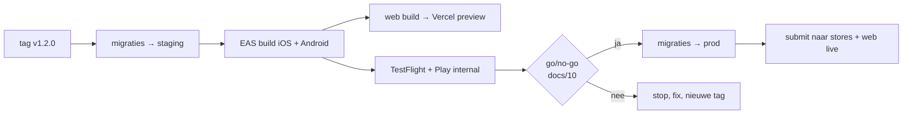

# 08 — Infrastructuur, omgevingen & CI/CD

## Omgevingen

Drie volledig gescheiden Supabase-projecten. Geen gedeelde databank tussen
staging en productie — dat is de enige manier waarop een testmigratie nooit
echte meldingen kan raken.

| | dev | staging | prod |
| --- | --- | --- | --- |
| Supabase | gratis plan of `supabase start` (lokaal) | gratis/Pro | **Pro** (backups + PITR) |
| Data | `db/seed/dev_seed.sql` | seed + eigen testmeldingen | echt |
| Servicegebied | ruim (of `enforce_service_area = false`) | België | België |
| App | Expo Go / dev client | TestFlight intern + Play internal testing | store + PWA |
| Foto-scan | mock (alles `safe`) | echte API, testkey | echte API |
| Sentry | uit | aan, aparte omgeving | aan |
| Wie kan erbij | ontwikkelaars | ontwikkelaars + testers | alleen jij |

Configuratie per omgeving zit in `.env.<omgeving>` (niet in git) en in EAS
build-profielen. De app leest `EXPO_PUBLIC_SUPABASE_URL`,
`EXPO_PUBLIC_SUPABASE_ANON_KEY`, `EXPO_PUBLIC_MAPTILER_KEY` en
`EXPO_PUBLIC_ENV`.

De `service_role`-key komt **nooit** in een `EXPO_PUBLIC_`-variabele — alles met
dat voorvoegsel zit in de app-bundle en is dus publiek.

## Databasemigraties

```bash
supabase link --project-ref <ref>
supabase db push              # past db/migrations/* toe
```

Regels:

1. Migraties zijn genummerd, onveranderlijk en additief. Een fout in een
   toegepaste migratie herstel je met een **nieuwe** migratie.
2. Elke migratie gaat eerst naar staging, daarna naar prod. Nooit
   omgekeerd, nooit rechtstreeks.
3. CI test elke migratie tegen een lege **en** een gevulde databank.
4. `db/scale/` valt buiten `supabase db push`: die pas je bewust en handmatig
   toe wanneer een opschaaltrigger afgaat.
5. Vóór een migratie op prod: `supabase db dump` als extra vangnet, ook al
   staat PITR aan.

## CI

`.github/workflows/ci.yml` — draait op elke push en PR:

| Stap | Wat het tegenhoudt |
| ---- | ------------------ |
| `pnpm lint` + `tsc --noEmit` | typefouten en dode code |
| `pnpm test` (unit: outbox-retries, puntenberekening, foutmapping) | logicafouten in de client |
| **DB-job**: migraties + `db/test/10_tests.sql` op postgis/postgis | een migratie die niet draait, een RLS-lek, een kapotte RPC |
| Migratie op een gevulde databank (seed → migraties) | migraties die enkel op een lege databank werken |
| `redocly lint api/openapi.yaml` | een API-contract dat niet meer geldig is |
| `pnpm audit --audit-level=high` | bekende kwetsbaarheden |
| Bundelgrootte-check (< 40 MB) | een app die te zwaar wordt |

De DB-job is de belangrijkste: hij bewijst bij elke commit opnieuw dat de
beveiligingsregels (RLS, rate limits, statusovergangen) nog werken.

## Release

`.github/workflows/release.yml` — op een tag `v*`:



### OTA-updates (EAS Update)

Wijzigingen in JavaScript (teksten, UI-fixes, foutmapping) gaan via EAS Update
naar bestaande installaties, zonder store-review. Dat is bij een eerste
roll-out goud: een verkeerde tekst of een crash in het meldformulier kan je
binnen tien minuten repareren.

Wat **niet** via OTA kan: nieuwe native modules, permissiewijzigingen,
versieverhogingen van de Expo SDK. Die vereisen een nieuwe store-build.

Regel: OTA-kanalen volgen de omgevingen (`development`, `staging`,
`production`), en een OTA-update gaat altijd eerst naar `staging`.

## Rollback

Voor elk onderdeel één procedure, en die moet **één keer echt uitgevoerd zijn**
vóór de publieke roll-out (het is een punt op de go/no-go-lijst):

| Wat stuk is | Rollback | Duur |
| ----------- | -------- | ---- |
| Slechte JS-release | EAS Update terugrollen naar de vorige update | < 10 min |
| Slechte native release | store-release pauzeren; gefaseerde uitrol (Android 5 %) beperkt de schade | uren (review) |
| Slechte migratie | herstelmigratie; bij dataverlies PITR naar het tijdstip vóór de push | 15–60 min |
| Edge Function stuk | vorige versie herdeployen (`supabase functions deploy --version`) | < 5 min |
| Spamgolf | `app_config`-limieten verlagen, eventueel `enforce_service_area` verkleinen | < 1 min |
| Foto-scan onbetrouwbaar | scanner op "alles quarantaine" zetten: liever een lege kaart dan een ongepaste foto | < 5 min |

Het laatste punt is een expliciete keuze: bij twijfel geven we
beschikbaarheid op, niet veiligheid.

## Geplande taken

| Taak | Frequentie | Waar |
| ---- | ---------- | ---- |
| `purge_old_data()` | dagelijks 03:17 | pg_cron |
| `refresh_report_clusters()` | elke 5 min (enkel na opschaalstap 1) | pg_cron |
| `cleanup-orphan-photos` | dagelijks | Edge Function: storage-objecten zonder rij in `report_photos` |
| Backupcontrole (kan ik écht terugzetten?) | maandelijks | handmatig, met checklist |
| Afhankelijkheden bijwerken | tweewekelijks | Dependabot-PR's |

De backupcontrole staat er bewust in: een backup die je nooit hebt teruggezet,
is een aanname.
