# 10 — Roll-out & testplan

Je wilde dit op verschillende toestellen kunnen testen. Dat is hier geen
bijkomstigheid: het bepaalt de keuze voor Expo/EAS, en het bepaalt de fasering.

## Drie manieren om te testen, in stijgende volgorde

| Manier | Wie kan meedoen | Hoe snel | Waarvoor |
| ------ | --------------- | -------- | -------- |
| **1. Web-URL (PWA)** | iedereen met de link, geen installatie | seconden | vroege feedback, alle toestellen tegelijk, ook toestellen die je niet bezit |
| **2. Expo Go / dev client** | jij + ontwikkelaars | minuten | dagelijkse ontwikkeling |
| **3. TestFlight + Play internal testing** | tot 100 (intern) / 10 000 (extern) testers | uren (build + review) | echte app, echte permissies, echte GPS |

Begin met 1 en 3 parallel. De web-versie geeft je binnen een dag feedback van
vijf verschillende toestellen; TestFlight/Play geeft je het echte gedrag van
camera, GPS en permissies.

**Belangrijk:** de web-versie is geen volledige vervanging. GPS-nauwkeurigheid,
cameragedrag, permissiedialogen, achtergrondsync en batterijgebruik gedragen
zich alleen op een echte app-installatie zoals bij je gebruikers. Bugs in die
vier gebieden vind je nooit in de browser.

## Device-matrix

Kolom "moet" = blokkeert de roll-out. Kolom "graag" = na de eerste release.

| Toestelklasse | Voorbeeld | Waarom net dit toestel | Prioriteit |
| ------------- | --------- | ---------------------- | ---------- |
| iPhone, recent | iPhone 14/15/16, iOS 17–18 | grootste iOS-groep | moet |
| iPhone, oud maar ondersteund | iPhone SE 2020 / 11, iOS 16 | klein scherm (375 pt) — het meldformulier moet passen | moet |
| Android, mid-range | Samsung A-serie, Android 13–14 | de grootste Android-groep in België | moet |
| Android, low-end | 2–3 GB RAM, Android 10–11 | trage kaart, slechte GPS, agressieve batterijbeperking | moet |
| Android, high-end | Pixel / Galaxy S, Android 14–15 | referentie voor "hoe het bedoeld is" | graag |
| Tablet | iPad, Android-tablet | de kaart mag niet breken op een groot scherm | graag |
| Mobiel web | Safari iOS, Chrome Android | de PWA-testweg | moet |
| Desktop web | Chrome, Firefox, Safari | de gemeente kijkt op een laptop | graag |

Minimumversies: **iOS 16+**, **Android 10+ (API 29)**. Dat dekt ruim 95 % van
de toestellen in gebruik en houdt de Expo-configuratie eenvoudig.

## Testscenario's per toestel

Loop deze lijst af op elk "moet"-toestel. Dit is de kern van de
device-validatie — de meeste echte bugs zitten in de rechterkolom.

### Locatie en GPS

1. Melden mét locatiepermissie, buiten, GPS-fix goed → pin staat juist.
2. Melden mét permissie, binnen, GPS onnauwkeurig (accuracy > 50 m) → app
   waarschuwt en laat de pin verslepen.
3. Locatiepermissie **geweigerd** → melden werkt nog, pin handmatig plaatsen.
4. Permissie eerst geweigerd, daarna in de systeeminstellingen toegestaan → app
   pikt het op zonder herstart.
5. Locatiediensten volledig uit op het toestel → duidelijke uitleg, geen crash.
6. Vliegtuigmodus → kaart uit cache, melding gaat naar de outbox.

### Camera en foto's

7. Foto met de camera, staand en liggend → **oriëntatie klopt na uploaden**
   (klassieke EXIF-valkuil; wij re-encoderen, dus dit moet expliciet af).
8. Foto uit de bibliotheek.
9. Camerapermissie geweigerd → melden zonder foto blijft werken.
10. Zeer grote foto (48 MP telefoon) → verkleinen mag niet crashen op een
    low-end toestel met weinig geheugen.
11. App wegzwiepen tijdens het uploaden → melding staat nog in de outbox en gaat
    later door.

### Netwerk

12. Melden op 4G, op wifi, en op een trage verbinding (throttle naar 2G).
13. Netwerk valt weg midden in het posten → geen dubbele melding
    (`client_ref`-idempotentie).
14. Vijf meldingen offline maken, dan online komen → alle vijf komen door, geen
    duplicaten.
15. Netwerk dat *zegt* dat het er is maar niets doorlaat (captive portal) →
    timeout en retry, geen vastloper.

### Kaart

16. Uit- en inzoomen van heel België tot straatniveau → clusters splitsen
    correct, geen haperingen op een low-end toestel.
17. Snel pannen → geen stapel verouderde antwoorden, geen flikkerende markers.
18. 200+ meldingen in het venster → scrollen blijft vloeiend.
19. Kaart zonder netwerk → getekende tiles blijven leesbaar.

### Systeem en UI

20. Donkere modus.
21. Lettergrootte op 200 % → meldformulier scrollt, niets valt weg.
22. Screenreader (VoiceOver / TalkBack) → drie typekeuzes en markers zijn
    aankondigbaar.
23. Inkomende oproep tijdens het melden → app herstelt in dezelfde stap.
24. Toestel draaien in elke stap.
25. Achtergrond → 10 minuten wachten → terug: sessie leeft nog, outbox is
    verstuurd.
26. App verwijderen en opnieuw installeren → anonieme sessie is weg, de
    gebruiker verliest "mijn meldingen". **Dit is bekend gedrag** en moet in de
    tekst staan (het is het gevolg van anonimiteit, zie
    [ADR 0003](adr/0003-anonieme-identiteit.md)).

### Misbruik en grenzen

27. 16 meldingen in een uur → `rate_limited` met begrijpelijke tekst.
28. Melding in Parijs (via de web-app met gespoofte locatie) →
    `outside_service_area`.
29. Tweemaal dezelfde plek melden → "je had dit al gemeld".
30. Een melding rapporteren → verdwijnt bij 3 flags, direct bij `private_person`.

## Fasering

```mermaid
gantt
    dateFormat X
    axisFormat %s
    section Fase 0 — intern
    Bouwen + dev-seed          :0, 3
    section Fase 1 — gesloten beta
    10-20 testers, 1 gemeente  :3, 3
    section Fase 2 — open beta
    100-500 gebruikers, 3 gemeenten :6, 4
    section Fase 3 — publiek
    Stores + PWA, hele regio   :10, 3
```

| Fase | Wie | Servicegebied | Wat we willen weten | Exitcriterium |
| ---- | --- | ------------- | ------------------- | ------------- |
| **0 — intern** | jij + 2-3 mensen | ruim | werkt de flow op elk moettoestel? | device-matrix af |
| **1 — gesloten beta** | 10–20 testers, 1 gemeente/gebied | die gemeente | wordt er echt gemeld? staan de pins juist? | ≥50 echte meldingen, 0 crashes in een week, 0 privacyklachten |
| **2 — open beta** | 100–500, PWA publiek + TestFlight extern | 3 gemeenten | houdt moderatie stand? blijft de kaart snel? | quarantaine <10/dag beheersbaar, p95 binnen SLO |
| **3 — publiek** | stores, hele regio | België | schaalt het? | — |

Gefaseerde uitrol in de stores: Android via een staged rollout (5 % → 20 % →
50 % → 100 %), iOS via gefaseerde release over 7 dagen. Zo raakt een slechte
release niet iedereen tegelijk.

## Go/no-go

Vóór fase 3 moet alles hieronder groen zijn. Één rood punt = uitstellen.

**Functioneel**
- [ ] Device-matrix (alle "moet"-toestellen) volledig afgelopen
- [ ] Scenario's 1–30 doorlopen op minstens één iOS- en één Android-toestel
- [ ] Offline melden getest met 5 meldingen zonder netwerk
- [ ] Web-app werkt op Safari iOS en Chrome Android

**Betrouwbaarheid**
- [ ] Crashgraad < 0,5 % in de open beta
- [ ] p95 van `map_reports` < 300 ms op productiedata
- [ ] Backup teruggezet in een test — één keer echt gedaan
- [ ] Rollbackprocedure één keer echt uitgevoerd (EAS Update terugrollen)
- [ ] Alerts vuren: één keer bewust getriggerd

**Veiligheid en privacy**
- [ ] Rate limits actief en getest op een echt toestel
- [ ] Servicegebied actief
- [ ] Fotoscan actief; geen enkel pad publiceert een ongescande foto
- [ ] `private_person`-fastpath getest
- [ ] Privacyverklaring en gebruiksvoorwaarden live en in de app bereikbaar
- [ ] Verwerkingsregister + DPIA afgerond
- [ ] Store-privacylabels kloppen met [07](07-privacy-security-moderatie.md)
- [ ] `service_role`-key komt niet voor in de app-bundle (grep de build)
- [ ] Takedown-e-mailadres bestaat en wordt gelezen

**Operationeel**
- [ ] Beheerdersconsole werkt; iemand kijkt dagelijks naar de wachtrij
- [ ] Reactietermijnen afgesproken (24 u / 72 u)
- [ ] `min_supported_app_version` ingesteld
- [ ] Store-listings, screenshots en supportadres klaar

## Wat we bewust níet testen vóór de roll-out

Loadtests boven 1 000 gelijktijdige gebruikers, meertaligheid buiten het
Nederlands, en tabletlayouts. Die staan in de matrix als "graag" — ze mogen de
eerste release niet ophouden, maar ze staan hier zodat je weet dat ze niet
vergeten zijn.
